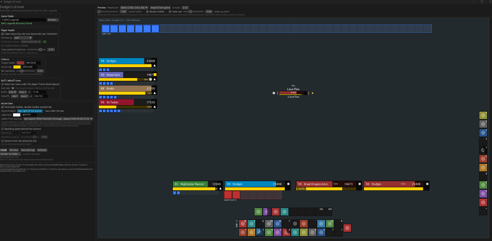
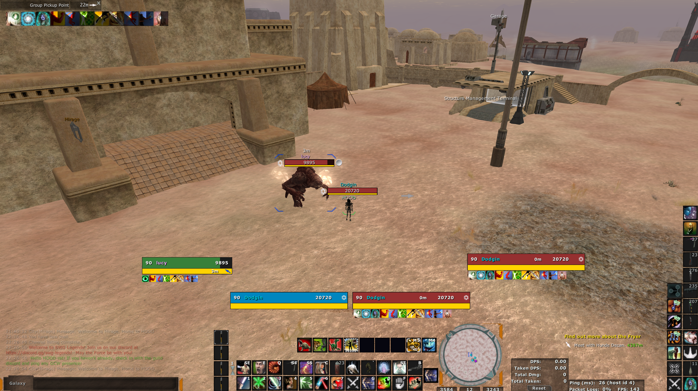

# dodgins-ui-mod

### Use this nifty tool:


### To make your SWG UI look like this:


Single-exe installer with a live preview for Dodgin's ElvUI-style SWG
unitframes (player, target, target-of-target / look-at target, group, pet,
overhead nameplates, buff windows) and action bars (toolbar, double toolbar,
pet bar).

* Rust + egui, no runtime dependencies.  The page templates live in
  `templates/` and are embedded at build time.  They are generated by
  `build_unitframes.py` and `build_actionbars.py`; when a `../unitframes`
  checkout sits next to this crate, `build.rs` copies its `templates/` in on
  every build, so regenerate, then `cargo build` and commit the updated
  `templates/`.
* Action bars (`ui_ground_hud_toolbar_skinned.inc` and the four side bars
  in `ui_ground_hud_side_toolbar_skinned.inc`, on by default, one checkbox
  to leave the stock toolbars alone): 36px buttons 2px apart, each under a
  1px black frame, keybind labels on every button.  The client labels slots
  1-12 itself; the double toolbar's top row and the pet bar get the keys
  bound in the character's keymap (`profiles\...\<id>.inp`, newest by
  default, pickable) baked in at install time, either in the top-right
  corner of the button (ElvUI) or in a row under the bar.  The pane number
  and prev / next buttons sit in a 14px column at the left, the big
  default-attack button is one more slot at the right.  Optional: a
  1px-bordered backdrop panel (colour and opacity) and the client's queue
  timer strip along the top, both off by default.  Everything the client
  drives at runtime (sample widgets, highlight overlays, cooldown pies,
  effectors) keeps its name and CodeData path; only positions and styles
  changed.
* Role colours: the installer patches the role swatches in `ui_styles.inc`,
  working from the bundled stock copy in `templates/stock/ui_styles.inc`.
  If the game ships a new `ui_styles.inc`, drop the fresh stock copy over
  that file and rebuild.
* Settings (`settings.json`) and the install manifest (`installed.json`)
  live next to the exe.  Previous loose files are kept as
  `<file>.pre-unitframes`; Remove puts them back and refuses to touch a file
  changed since install unless Force is ticked.

## Build

```
cargo build --release        # target/release/dodgins-ui-mod.exe (~6 MB)
cargo test
```

## Releasing

`.github/workflows/release.yml` builds and tests on every push and PR.  On a
push to `main`, if `version` in `Cargo.toml` has no `v<version>` tag yet, it
tags the commit and publishes a GitHub release with
`dodgins-ui-mod-v<version>-windows-x64.exe` and a checksum file.  To ship:
bump `version`, push.

## Headless

```
dodgins-ui-mod.exe --render DIR                 # write the files, install nothing
dodgins-ui-mod.exe --install                     # same as the Install button
dodgins-ui-mod.exe --remove [--force]
dodgins-ui-mod.exe --settings FILE --render DIR  # use another settings file
```

The preview uses sample data; its fonts and icon art stand in for the game's,
but every position, size and colour is the same number the templates carry.
